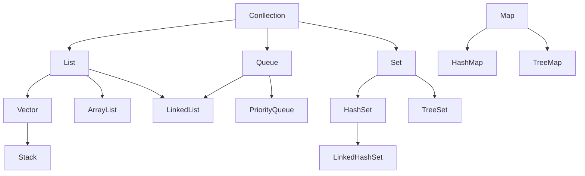

## [Java面试题汇总](/2019/03/13/java面试/Java面试题汇总/)（二）容器

#### java 容器都有哪些？

#### Collection 和 Collections 有什么区别？

- java.util.Collection是一个集合接口（集合类的顶级接口）。它提供了对集合对象进行基本操作的通用接口方法。Collection接口在Java类库中有很多具体的实现。Collection接口的意义是为各种具体的集合提供了最大化的统一操作方式，其直接继承接口有List和Set。

- Collections则是集合类的一个工具类/帮助类，其中提供了一系列静态方法，用于对集合中元素进行排序、搜索以及线程安全等各种操作。

#### List、Set、Map 之间的区别是什么？

|    比较    |                        List                         |                     Set                      |                             Map                              |
| :--------: | :-------------------------------------------------: | :------------------------------------------: | :----------------------------------------------------------: |
|  继承接口  |                     Collection                      |                  Collection                  |                              --                              |
| 常见实现类 |            ArrayList、LinkedList、Vector            |       HashSet、LinkedHashSet、TreeSet        |                 HashMap、HashTable、TreeMap                  |
|  常见方法  | add()、remove()、clear()、get()、contains()、size() | add()、remove()、clear()、contains()、size() | put()、get()、remove()、clear()、containsKey()、containsValue()、keySet()、values()、size() |
|    元素    |                       可重复                        |          不可重复（用equals()判断）          |                         key不可重复                          |
|    顺序    |                        有序                         |         无序（实际上有HashCode决定）         |                              --                              |
|  线程安全  |                   Vector线程安全                    |                      --                      |                      HashTable线程安全                       |

#### HashMap 和 HashTable 有什么区别？

- HashMap去掉了HashTable的contains方法，但是加上了containsValue()和containsKey()方法；
- HashMap是非线程安全的，HashTable是线程安全的，HashMap效率上比HashTable要高；
- HashMap允许空键值，而HashTable不允许。

#### 如何决定使用 HashMap 还是 TreeMap？

#### 说一下 HashMap 的实现原理？

#### 说一下 HashSet 的实现原理？

#### ArrayList 和 LinkedList 的区别是什么？

#### 如何实现数组和 List 之间的转换？

#### ArrayList 和 Vector 的区别是什么？

#### Array 和 ArrayList 有何区别？

#### 在 Queue 中 poll()和 remove()有什么区别？

#### 哪些集合类是线程安全的？

#### 迭代器 Iterator 是什么？

#### Iterator 怎么使用？有什么特点？

#### Iterator 和 ListIterator 有什么区别？

